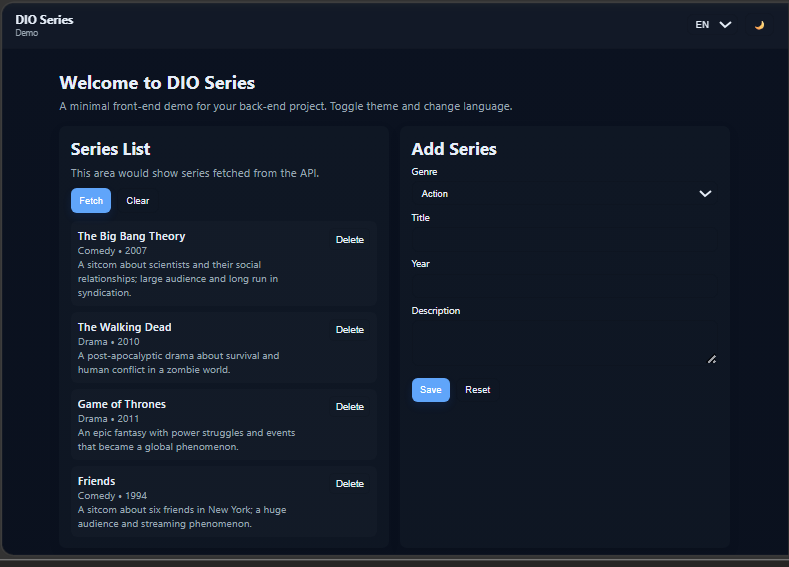

# Daily Learning

## Creating an in-memory registration APP

Project developed at Bootcamp .Net Fundamentals of Digital Innovation One with guidance from specialist [Eliézer Zarpelão](https://github.com/elizarp "Eliézer Zarpelão").
Learning how to create a simple series registration algorithm.
In this project we learned how to model your domain, how to use collection resources to save your data in memory and practice object-oriented knowledge, the main programming paradigm used in the market.

Technologies used:
- C#
- CSS
- HTML
- JavaScript
- AI

[LICENSE](./LICENSE)

See [original repository](https://github.com/elizarp/dio-dotnet-poo-lab-2).
